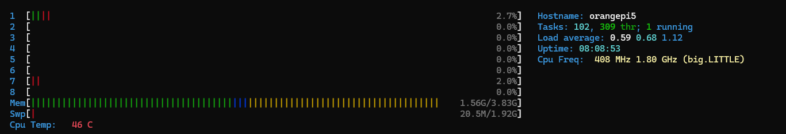
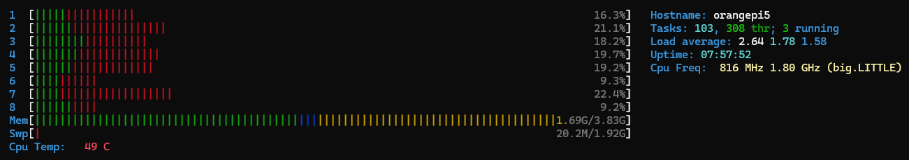
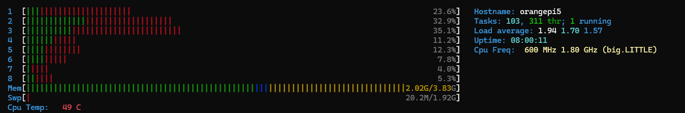
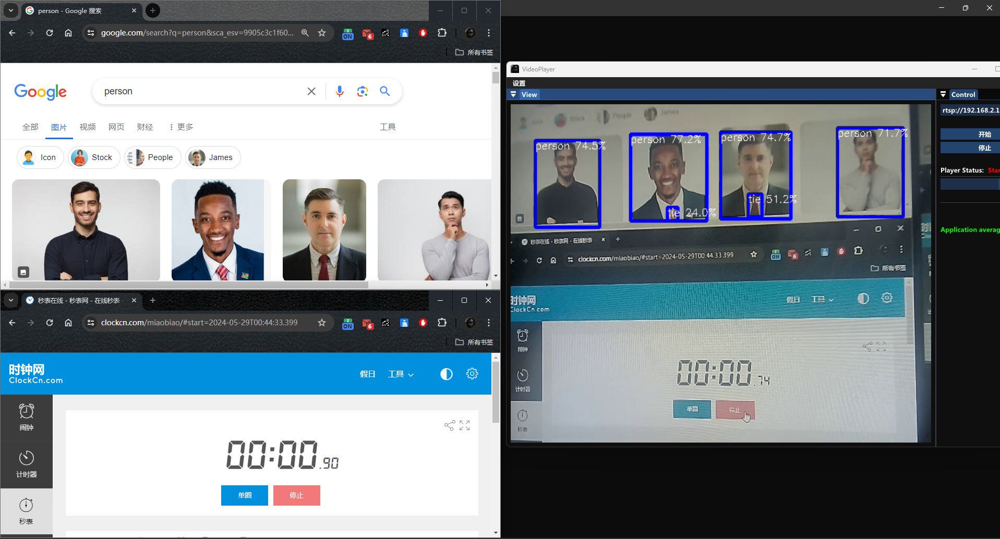
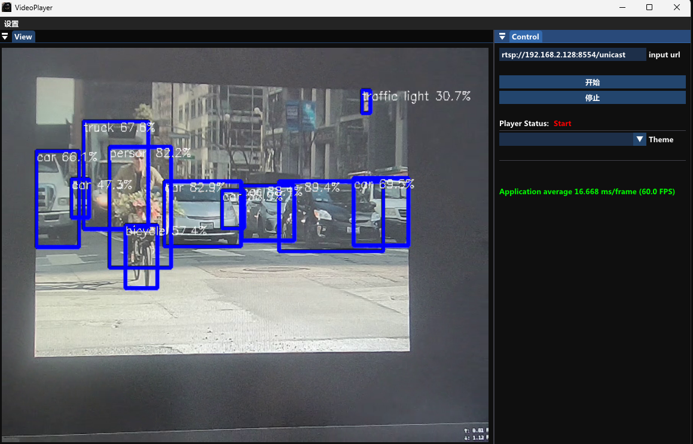

# RkCamRtspServer
simple yolov5 rtspserver for rk3588

## test env
- rk3588s
- ubuntu 20.04
- USB camera

## build && run
```
./scripts/build_mpp.sh
mkdir build && cd build
cmake ..
make -j4
sudo ./RkYoloRtspServer
```

## config
config with file configs/config.ini
```
[rknn]
model_path = model/yolov5.rknn
rknn_thread = 3 # max 6, too big and useless;

[log]
level = NOTICE

[video]
width = 640
height = 480
fps = 30
fix_qp = 23     
device = /dev/video0

[server]
rtsp_port = 8554
stream_name = unicast
max_buf_size = 200000
max_packet_size  = 1500
http_enable = false
http_port = 8000
bitrate = 1440
```

## function
- support yuy2 format usb camera.
- support hardware h264 encode.
- yolov5 target detection
- multiple npu

## resource utilization
- yolov5s

```
1 -- NPU load:  Core0: 38%, Core1:  0%, Core2:  0%,
2 -- NPU load:  Core0: 25%, Core1: 26%, Core2:  0%,
3 -- NPU load:  Core0: 16%, Core1: 17%, Core2: 17%,
4 -- NPU load:  Core0: 23%, Core1: 13%, Core2: 13%,
5 -- NPU load:  Core0: 20%, Core1: 20%, Core2: 10%,
6 -- NPU load:  Core0: 16%, Core1: 17%, Core2: 17%,
```

- yolov5m

```
1 -- NPU load:  Core0: 75%, Core1:  0%, Core2:  0%,
2 -- NPU load:  Core0: 69%, Core1: 74%, Core2:  0%,
3 -- NPU load:  Core0: 49%, Core1: 49%, Core2: 49%,
4 -- NPU load:  Core0: 71%, Core1: 38%, Core2: 39%,
5 -- NPU load:  Core0: 59%, Core1: 60%, Core2: 30%,
6 -- NPU load:  Core0: 49%, Core1: 50%, Core2: 49%,
```

- free



- 3 thread



- 6 thread



## demo

- yolov5s


- yolov5m


## tags Notes
```
v1.0.0 -- single npu && corresponds to rktoolkit 1.5.0 or below
v1.1.0 -- multiple npu && corresponds to rktoolkit 1.5.0 or below
v2.0.0 -- multiple npu && corresponds to rktoolkit 1.5.2 or up
```
